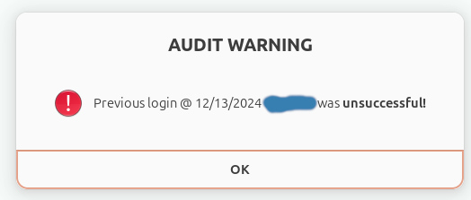
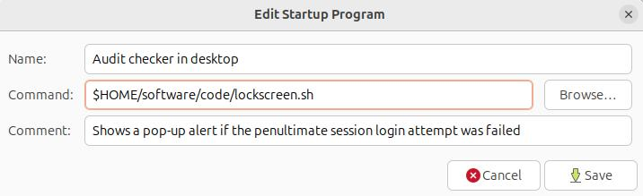

Whenever you log into your computer via the graphical interface, you will receive a pop-up desktop notification/alert in case there has previously been unsuccessful login attempts. This is useful, for instance, to check if an intruder has attempted to log into your computer while it was locked, trying different passwords.

This software is entirely based on a shell script. The script is designed to run for a specific user, although it will also catch unsuccessful login attempts into other user accounts. The script runs as non-root.

## Requirements

Linux with GDM as display manager
(tested on Ubuntu >= 20.04)

I you don't know what is your display manager, run the command `cat /etc/X11/default-display-manager`. You should get `/usr/sbin/gdm3`

## Installation

`mkdir -p $HOME/software/code/`

`mkdir -p $HOME/software/logs/`

Copy `lockscreen.sh` and `lockscreen2.sh` onto `$HOME/software/code/`

`chmod u+x $HOME/software/code/lockscreen.sh`

`chmod u+x $HOME/software/code/lockscreen2.sh`

Add a startup program in the Startup Applications app with the command `$HOME/software/code/lockscreen.sh` as shown below

Log out and log in again to make the changes take effect.

## Troubleshooting

Check `$HOME/software/logs/badlogin_desktop.log`

## License

See the [LICENSE](LICENSE)